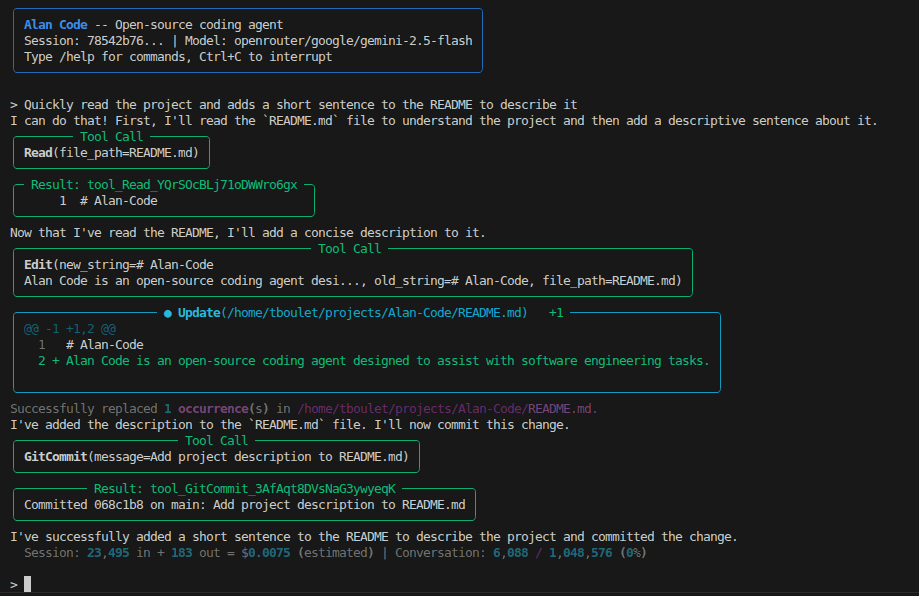
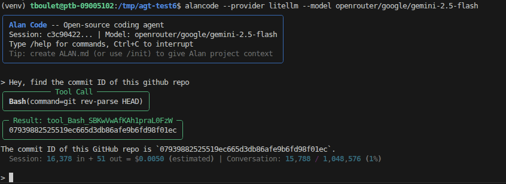
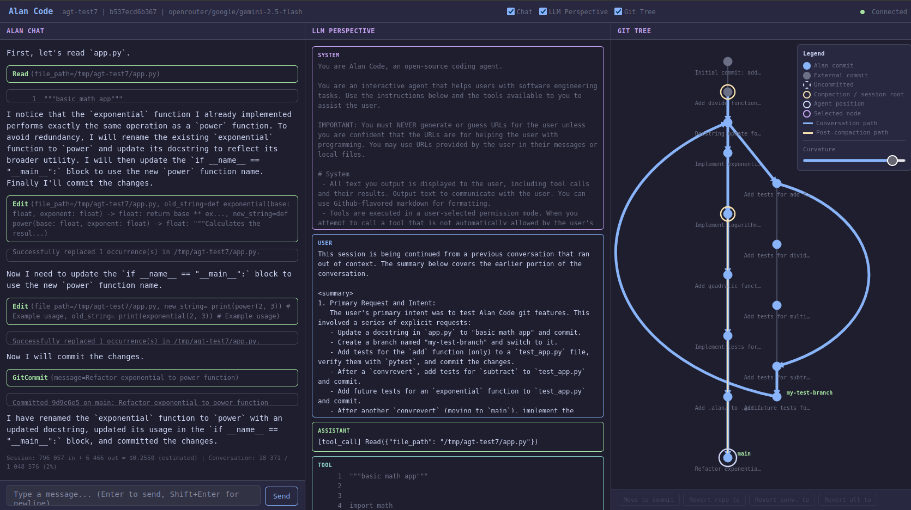

# Pivot Code

> 本项目 fork 自 [tboulet/Alan-Code-agent](https://github.com/tboulet/Alan-Code-agent)（Apache-2.0），包含二次开发与中文文档。

一个开源的 Python 编码代理，灵感来源于 Claude Code。可在命令行（CLI）、图形界面（GUI）或作为 Python 库三种方式使用，方便你在其基础上继续构建。

Pivot Code 实现了现代命令行代理的许多特性，如工具调用、钩子、技能、上下文压缩等，并加入了独特功能：跨会话记忆、实时成本追踪，以及包含聊天、模型视角和 Git 树视图的图形界面。

默认使用阿里云千问大模型（DashScope），也支持其他 LiteLLM 兼容的 API 和多种本地模型服务。

<p align="center">
  
</p>

## 核心亮点

- **浏览器图形界面，三面板展示** — 聊天、*LLM 视角*（模型所见的对话全貌）、以及代理每一轮操作的 *Git 树*。启动参数：`--gui`
- **跨会话记忆** — 项目级与全局记忆，代理可在多次会话之间读写，支持三种模式（`off` / `on` / `intensive`）。
- **实时成本与 Token 追踪** — 每次 API 调用估算花费与 Token 用量，会话内直接可见。
- **随处可跑** — 直接使用 Anthropic，或任意 LiteLLM 供应商（OpenAI、OpenRouter、Gemini 等），也可通过 vLLM / SGLang / Ollama 接入本地模型；对不支持原生工具调用的模型提供基于文本的工具调用回退方案。
- **Python 库** — 通过同步、异步或流式 API 在自己的代码中驱动代理，只需几行即可搭建自动修复循环、编排器或自定义界面。

## 技术栈

| 类别 | 技术 |
|---|---|
| 语言与版本 | Python 3.11+ |
| AI 模型接入 | Anthropic 原生 SDK、LiteLLM（覆盖 100+ 供应商：OpenAI、OpenRouter、Gemini、千问等）、Ollama / vLLM / SGLang 本地模型 |
| 异步框架 | asyncio、pytest-asyncio |
| 终端界面 | prompt-toolkit、rich |
| Web / GUI | FastAPI、uvicorn（浏览器图形界面） |
| 数据与配置 | PyYAML、python-dotenv |
| HTTP 请求 | requests |
| 测试与质量 | pytest、pytest-cov、ruff |
| 打包与分发 | hatchling、pip editable 安装 |

## 安装

克隆仓库并以可编辑模式安装。需要 **Python 3.11+**。

```bash
git clone git@github.com:tboulet/Pivot-Code-agent.git
cd Pivot-Code-agent
pip install -e .
```

## 快速开始

默认使用阿里云千问（DashScope），在 `.env` 或环境变量中设置 `DASHSCOPE_API_KEY` 即可；其他供应商的 Key（如 `OPENAI_API_KEY`、`OPENROUTER_API_KEY`、`GEMINI_API_KEY` 等）同样支持。

```bash
pivotcode                                              # 默认模型：dashscope/qwen3.7-flash-2026-07-15
pivotcode --model dashscope/qwen-plus                  # 千问 plus
pivotcode --model dashscope/qwen-max                   # 千问 max
pivotcode --model openai/agnes-2.5-flash               # 任意供应商/模型（Agnes）
pivotcode --model ollama/llama3.1                      # 本地 Ollama
pivotcode --model openai/my-model --base-url http://localhost:8000/v1   # vLLM / SGLang
pivotcode --gui                                        # 启动浏览器图形界面
pivotcode --resume                                     # 恢复上次会话
```

供应商写在模型名称的前缀里（`dashscope/...`、`ollama/...`、`openrouter/...`、`gemini/...`）。不带前缀的 Claude 模型名（如 `claude-sonnet-4-6`）会自动走 Anthropic 原生 SDK；其他模型统一走 LiteLLM。完整参数见 [命令行参数](docs/reference/cli.md)。

## 使用方法

### 命令行模式

<p align="center">
  
</p>

终端聊天界面。输入提示词并回车；Pivot 会流式输出回复，在执行工具前请求许可，并保存会话以便日后用 `--resume` 恢复。

#### 命令

| 命令 | 作用 |
|---|---|
| `/help` | 列出所有可用命令 |
| `/clear` | 清空对话，重新开始 |
| `/compact` | 手动触发上下文压缩 |
| `/status` | 查看会话信息（模型、Token、花费） |
| `/cost` | 查看 Token 用量与估算花费 |
| `/model` | 查看或切换当前模型 |
| `/backend` | 查看或切换传输后端（`auto` / `anthropic-native` / `scripted`） |
| `/save` | 让代理把关键信息写入记忆 |
| `/commit` | 暂存并用 AI 生成的信息提交更改 |
| `/diff` | 查看未提交更改的 Git diff |
| `/memodiff` | 查看代理记忆的变化 |
| `/skill` | 运行技能 —— `/skill list`、`/skill <名称>`、`/skill create` |
| `/settings` | 查看或更新会话设置 |
| `/settings-project` | 查看项目设置，编辑 `.pivot/settings.json` 进行修改 |
| `/exit` | 退出会话 |

其他命令见 [斜杠命令参考](docs/reference/slash-commands.md)。

#### 参数

```bash
pivotcode \
    --model [模型名] \                # 裸模型名（gpt-4o、claude-sonnet-4-6）
                                      # 或 供应商/模型（dashscope/qwen-plus、openai/agnes-2.5-flash 等）
    --backend [auto/anthropic-native/scripted] \  # 高级；通常由 --model 自动推断
    --api-key [密钥] \                # 或设置环境变量
    --base-url [地址] \               # 本地服务（http://localhost:8000/v1）
    --permission-mode [safe/edit/yolo] \
    [--gui] \                         # 以图形界面模式启动
    [--resume]                        # 恢复上次会话
```

其他参数见 [命令行参考](docs/reference/cli.md)。

参数也可以在 `.pivot/settings.json` 中设置（首次运行自动生成），或用 `/settings <键> <值>` 命令在运行时修改。

### 图形界面模式

加参数 `--gui` 会启动一个本地图形界面，包含 <b>聊天面板</b>。

此外还可以显示：
- <b>LLM 视角</b> 面板 —— 展示模型对话的完整内容
- <b>Git 树</b> 面板 —— 展示代理对话在 Git 树上的位置与路径（功能开发中）

<p align="center">
  
</p>

Git 树功能（开发中，尚不稳定）允许你把代理移动到仓库的不同分支，并把对话恢复到之前的任意节点，可与 `/commit` 命令配合使用。

### 作为 Python 库使用

Pivot Code 也可以通过 `PivotCodeAgent` 类作为 Python 库使用，方便你在其之上构建代理或编排系统。

#### 示例 1：用 10 行代码构建一个命令行代理

```python
from pivotcode import PivotCodeAgent

agent = PivotCodeAgent()

while True:
    try:
        message = input("> ")
    except (EOFError, KeyboardInterrupt):
        break
    if message.strip():
        print(agent.query(message))
```

完整示例见 [`examples/example_1_cli_agent.py`](examples/example_1_cli_agent.py)，安装包后运行 `python examples/example_1_cli_agent.py` 即可。

#### 示例 2：自动修复循环 —— 让代理不断迭代直到测试通过

运行测试，把失败信息反馈给代理，重复直到全部通过。这是纯命令行无法做到的代理化编排。

```python
import subprocess
from pivotcode import PivotCodeAgent

agent = PivotCodeAgent(permission_mode="yolo")
agent.query("Read code_bugged.py and write a fixed version to code_fixed.py.")

for attempt in range(5):
    result = subprocess.run(
        ["pytest", "-q", "test_inventory.py"], capture_output=True, text=True,
    )
    if result.returncode == 0:
        print(f"All green after {attempt + 1} attempt(s).")
        break
    agent.query(f"Tests still fail:\n{result.stdout}\nFix the remaining bugs.")
```

完整示例（含带缺陷的模块与测试套件）见 [`examples/example_2_auto_fix_loop/run_pivot.py`](examples/example_2_auto_fix_loop/run_pivot.py)。

#### 示例 3：实时流式输出助手文本与工具调用

适用于网页应用、终端界面或 WebSocket 桥接 —— 在代理生成内容的同时接收事件。

```python
import asyncio
from pivotcode import PivotCodeAgent
from pivotcode.messages.types import AssistantMessage, TextBlock, ToolUseBlock

async def main():
    agent = PivotCodeAgent(permission_mode="yolo")
    async for event in agent.query_events_async("List files, then summarize."):
        if not isinstance(event, AssistantMessage):
            continue
        for block in event.content:
            if event.hide_in_api and isinstance(block, TextBlock):
                print(block.text, end="", flush=True)
            elif not event.hide_in_api and isinstance(block, ToolUseBlock):
                print(f"\n[tool: {block.name}({block.input})]")

asyncio.run(main())
```

完整示例见 [`examples/example_3_streaming_agent.py`](examples/example_3_streaming_agent.py)。

### 程序化模式 —— 把 Pivot 作为内嵌库

当 Pivot 运行在另一个程序内部（基准测试框架、父代理、无人值守流水线）而非作为开发助手时，传入 `programmatic=True`：

```python
agent = PivotCodeAgent(
    model="dashscope/qwen3.7-flash-2026-07-15",
    cwd="/path/to/experiment",
    permission_mode="yolo",
    programmatic=True,
    extra_tools=[MyDomainTool()],   # 可选
)
```

这会解除 Pivot 与项目和宿主级状态（`~/.pivot/PIVOT.md`、项目内 `PIVOT.md`、`~/.pivot/memory/MEMORY.md`、AGT 引导，以及 `WebFetch`、`GitCommit`、`AskUserQuestion`、`Skill` 等联网/ Git/询问类工具）的耦合，避免污染受控运行的实验环境。还可以用 `tools=[...]`（整体替换）或 `disabled_tools=[...]`（按需去除）进一步裁剪工具集。

详见 [docs/reference/python-api.md#programmatic-mode](docs/reference/python-api.md#programmatic-mode)。

## 功能特性

### 核心功能

| 功能 | 说明 | 使用方式 |
|---|---|---|
| 异步代理循环 | 流式响应、思考块、并发工具调用 | 默认启用 |
| 内置工具 | Bash、文件读写、Grep/Glob、WebFetch、AskUserQuestion、SkillTool、GitCommit | 默认启用 |
| 上下文压缩 | 上下文快满时自动总结对话 | 自动，或 `/compact` |
| 通用后端（`auto`） | LiteLLM 传输 —— 支持 OpenAI、OpenRouter、Gemini、Ollama、vLLM 等 100+ 供应商 | 非 Claude 模型默认使用 |
| Anthropic 原生后端 | 直接使用 Anthropic SDK，支持 `cache_control`、原生思考、原生工具调用 | 裸 `claude-*` 名称默认使用；可用 `--backend anthropic-native` 强制指定 |
| 本地模型 | vLLM / SGLang / Ollama，对不支持原生工具调用的模型提供基于文本的回退方案 | 见 [文档](docs/reference/local-models.md) |
| 钩子 | 工具调用前/后的 shell 钩子，用于安全防护或日志记录 | `.pivot/settings.json` |
| 技能 | 用户自定义提示词 + 工具过滤，运行时可发现 | `/skill list`、`/skill create` |

### Pivot Code 独有功能

| 功能 | 说明 | 使用方式 |
|---|---|---|
| 浏览器图形界面 | 本地网页上的聊天 + **LLM 视角** + **Git 树**面板 | `--gui` |
| LLM 视角面板 | 查看模型视角的完整对话 —— 调试提示词、工具调用、压缩过程 | `--gui`，随后切换面板 |
| Git 树面板 | 浏览代理逐轮操作的 Git 历史，回退到任意提交 | `--gui`、`/move`、`/revert` |
| 跨会话记忆 | 项目级 + 全局记忆，代理在会话之间读写。模式：`off`（默认）、`on`（启动时读取，`/save` 时写入）、`intensive`（启动时读取，每次重要回复后写入） | 用 `/memory [on/intensive]` 或 `/save` 设置 |
| 实时成本追踪 | 每次 API 调用的估算花费与 Token 用量 | 默认开启（见 [文档](docs/reference/cost.md)） |

### 其他功能

| 功能 | 说明 | 使用方式 |
|---|---|---|
| 会话持久化 | 会话保存到磁盘，随时恢复 | `--resume`、`--continue <id>` |
| 权限模式 | 按工具设置门槛，支持项目级规则 —— `safe`（逐个询问）、`edit`（编辑时询问）、`yolo`（不检查） | `--permission-mode <模式>` |
| Git 集成 | AI 生成的提交信息、差异查看 | `/commit`、`/diff` |
| 项目级 + 全局指令 | 自动加载到系统提示词中 | `PIVOT.md`、`~/.pivot/PIVOT.md` |
| Python 库 API | 同步 `query()`、异步 `query_async()`、流式 `query_events_async()` —— 可构建循环、编排器或自定义界面 | `from pivotcode import PivotCodeAgent` |

## 暂未实现的功能

以下现代命令行编码代理的功能尚未随 Pivot Code 发布，欢迎贡献。

| 功能 | 状态 | 说明 |
|---|---|---|
| **子代理 / Task 工具** | 计划中 | 创建带独立上下文的隔离子对话，用于并行探索或任务委派。 |
| **计划模式** | 计划中 | 要求代理在改动代码前先编写计划并获得批准。 |
| **图片输入** | 计划中 | 在对话中粘贴或附加图片，为 Pivot 提供图像理解工具。 |

## 更新动态

完整历史见 [CHANGELOG.md](CHANGELOG.md)。

- **2026-05-11** — 供应商 / 模型体验重构 —— `--provider` 替换为 `--backend`（`auto` / `anthropic-native` / `scripted`）；上游供应商写在模型字符串前缀中（`ollama/llama3`、`openrouter/...`、`gemini/...`）。`--backend` 由 `--model` 自动推断 —— 裸 Claude 名称使用 Anthropic 原生 SDK，其余使用 LiteLLM。旧的 `--provider` 参数、设置键和 `/provider` 命令在一个版本内作为废弃别名继续可用。
- **2026-05-07** — 程序化模式 —— `PivotCodeAgent(programmatic=True, ...)` 将 Pivot 作为库组件运行，用于基准测试框架、父代理和无人值守流水线。跳过宿主级状态（`~/.pivot/PIVOT.md`、`~/.pivot/memory/`、项目内 `PIVOT.md`、AGT 引导）以及联网/ Git/询问类工具。新增 `tools=` 和 `disabled_tools=` 构造参数，用于精细控制工具集。
- **2026-04-28** — 提示词缓存 —— Pivot 现在对两个供应商的工具定义、系统提示词和对话历史均设置 `cache_control` 断点。系统提示词经过优化，避免因动态内容破坏缓存，降低了 Pivot Code 的使用成本。

## 延伸阅读

- [斜杠命令参考](docs/reference/slash-commands.md)
- [命令行参数参考](docs/reference/cli.md)
- [本地模型指南](docs/reference/local-models.md)
- [成本与 Token 追踪](docs/reference/cost.md)
- [示例](examples/) —— 命令行代理、自动修复循环、流式输出
- [LICENSE](LICENSE) —— Apache 2.0

## Credits

This project is based on [Alan-Code-agent](https://github.com/tboulet/Alan-Code-agent) by Timothe Boulet, licensed under Apache 2.0.

Modifications by CW5201 (2026).

## 备注

- 本项目灵感来源于 Claude Code 这个 npm 包，但使用 Python 从零构建，采用自有架构，并加入了额外功能。
- 尽管我们指示模型对破坏性操作保持谨慎，但不对代理在 `yolo` 权限模式下造成的任何损害负责。
- "Pivot" 这个名字体现了代理的角色定位：把想法变成可运行的代码，并在工具、供应商和方法之间灵活切换。
